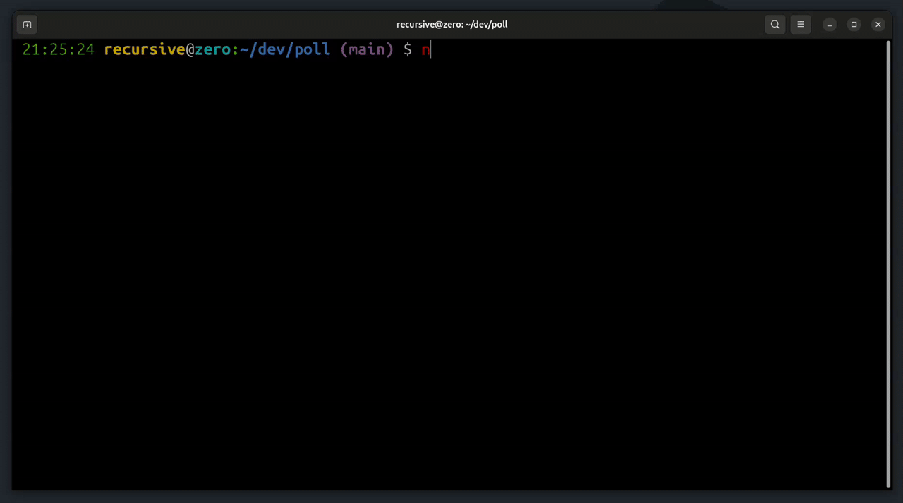

# GitHub Health File Check

<!-- Badges -->

![License][license]
[![Open Issues][issues]][issue-link]
![Commit Count][commits]
[![Pull Request][PR]][pr-link]
![npm version][npm version]
![total download][download]

<!--  -->

```bash
 npx gh-repo-care
```



## What are Community Health Files?

> [!TIP]
> Read official Github docs to know more about [Community Health Files][community-files].

## What this package does ?

This is a npm based CLI tool check your GitHub repo and generate basic community health files in `.github` folder (if not exist) or user defined folder.

This tool generate below files with your personalized information

- necessary community health files
- Issues templates
- Discussions templates
- Pull Request template
- Funding information

and below is the final folder structure

<details><summary>
  <mark> Health File Tree</mark>
</summary>

```lang-none
├── .github
│   ├── CODEOWNERS
│   ├── CODE_OF_CONDUCT.md
│   ├── CONTRIBUTING.md
│   ├── DISCUSSION_TEMPLATE
│   │   ├── announcements.yml
│   │   └── ideas.yml
│   ├── FUNDING.yml
│   ├── GOVERNANCE.md
│   ├── ISSUE_TEMPLATE
│   │   ├── BUG_REPORT.yml
│   │   ├── ENHANCEMENT.yml
│   │   ├── FEATURE_REQUEST.md
│   │   ├── QUESTION.md
│   │   └── config.yml
│   ├── PULL_REQUEST_TEMPLATE.md
│   ├── SECURITY.md
│   ├── SUPPORT.md

```

</details>

## Pre-requisite

- Node 20+

## How to start

install the repo in your node based project

```sh
npm install @xkeshav/gh-repo-care
```

and then run

```sh
npx gh-repo-care
```

it will ask few questions and then generate files.

> [!NOTE]
> if you have `.github` folder in your repo, then it will ask for a folder name, where it will generate the files, but later you have to move these files into `.github` folder, to make it useful.

## License

This project is licensed under the [MIT License][license-link].

---

<!-- References -->

[license]: https://badgen.net/github/license/xkeshav/gh-repo-care
[issues]: https://badgen.net/github/open-issues/xkeshav/gh-repo-care
[PR]: https://badgen.net/github/prs/xkeshav/gh-repo-care
[commits]: https://badgen.net/github/commits/xkeshav/gh-repo-care/main?color=green

<!--[license]: https://badgen.net/npm/license/@xkeshav/gh-repo-care-->

[npm version]: https://badgen.net/npm/v/@xkeshav/gh-repo-care
[download]: https://badgen.net/npm/dy/@xkeshav/gh-repo-care
[issue-link]: https://github.com/xkeshav/gh-repo-care/issues
[license-link]: https://github.com/xkeshav/gh-repo-care/blob/main/LICENSE
[pr-link]: https://github.com/xkeshav/gh-repo-care/pulls
[community-files]: https://docs.github.com/en/enterprise-server@3.10/communities/setting-up-your-project-for-healthy-contributions/creating-a-default-community-health-file
