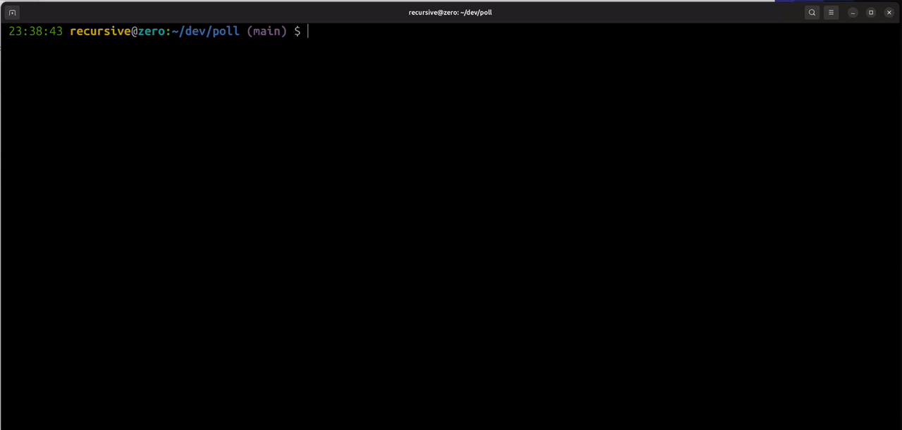

# GitHub Health File Check

<!-- Badges -->

![License][license]
[![Open Issues][issues]][issue-link]
![Commit Count][commits]
[![Pull Request][PR]][pr-link]
![npm version][npm version]
![total download][download]

<!--  -->



## What it is ?

> [!Info]
> Read [Official GitHub Docs][community-files] to know what are community health files

This is a npm based CLI tool which help to check your GitHub repo and generate community health files in `.github` folder (if not exist) or user defined folder name.

This tool update necessary details in the community health files and apart from that this tool help to generate customized issues and discussions template

and below are the files in generated folder

<details><summary>
  <mark> Health File Tree</mark>
</summary>

```lang-none
├── .github
│   ├── CODEOWNERS
│   ├── CODE_OF_CONDUCT.md
│   ├── CONTRIBUTING.md
│   ├── DISCUSSION_TEMPLATE
│   │   ├── announcements.yml
│   │   └── ideas.yml
│   ├── FUNDING.yml
│   ├── ISSUE_TEMPLATE
│   │   ├── BUG_REPORT.yml
│   │   ├── ENHANCEMENT.yml
│   │   ├── FEATURE_REQUEST.md
│   │   ├── QUESTION.md
│   │   └── config.yml
│   ├── PULL_REQUEST_TEMPLATE.md
│   ├── SECURITY.md
│   ├── SUPPORT.md

```

</details>

## Pre-requisite

- Node 20+

## How to start

```bash
npm install @xkeshav/gh-repo-check
```

and then run

```sh
npx gh-repo-check
```

it will ask few question and then generate files,

> [!Note]
> if you already have `.github` folder in your repo, then it will ask new folder name, where it will generate
> later you have to move these files into `.github` folder, to make it useful.

### Note

one file _Funding.yml_ file get generated, you can keep it empty for now.

## License

This project is licensed under the [MIT License][license-link].

---

<!-- References -->

[license]: https://badgen.net/github/license/xkeshav/gh-repo-check
[issues]: https://badgen.net/github/open-issues/xkeshav/gh-repo-check
[PR]: https://badgen.net/github/prs/xkeshav/gh-repo-check
[commits]: https://badgen.net/github/commits/xkeshav/gh-repo-check/main?color=green

<!--[license]: https://badgen.net/npm/license/@xkeshav/gh-repo-check-->

[npm version]: https://badgen.net/npm/v/@xkeshav/gh-repo-check
[download]: https://badgen.net/npm/dt/@xkeshav/gh-repo-check
[issue-link]: https://github.com/xkeshav/gh-repo-check/issues
[license-link]: https://github.com/xkeshav/gh-repo-check/blob/main/LICENSE
[pr-link]: https://github.com/xkeshav/gh-repo-check/pulls
[community-files]: https://docs.github.com/en/enterprise-server@3.10/communities/setting-up-your-project-for-healthy-contributions/creating-a-default-community-health-file
